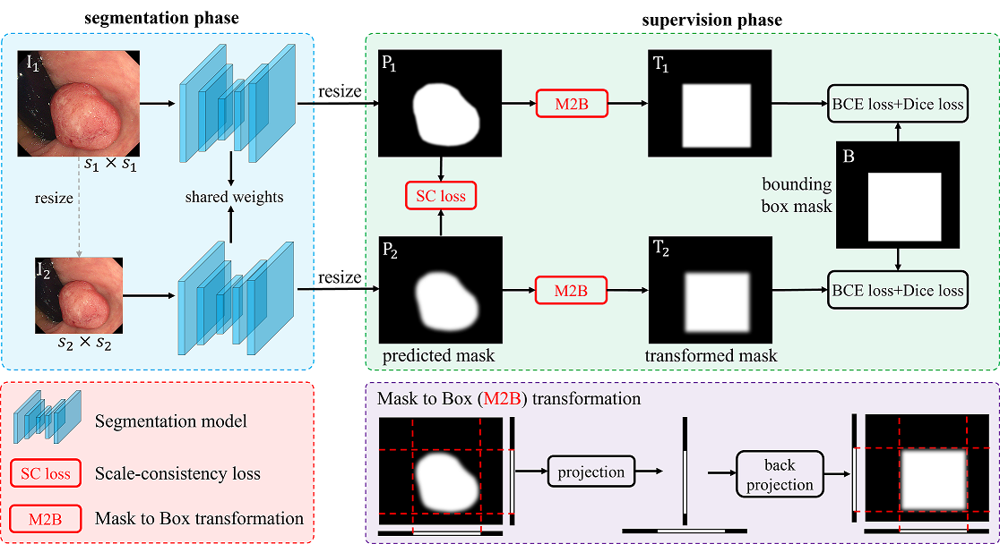
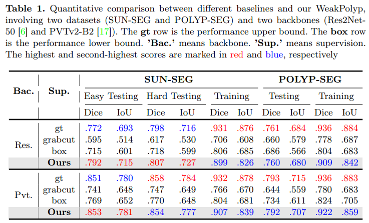
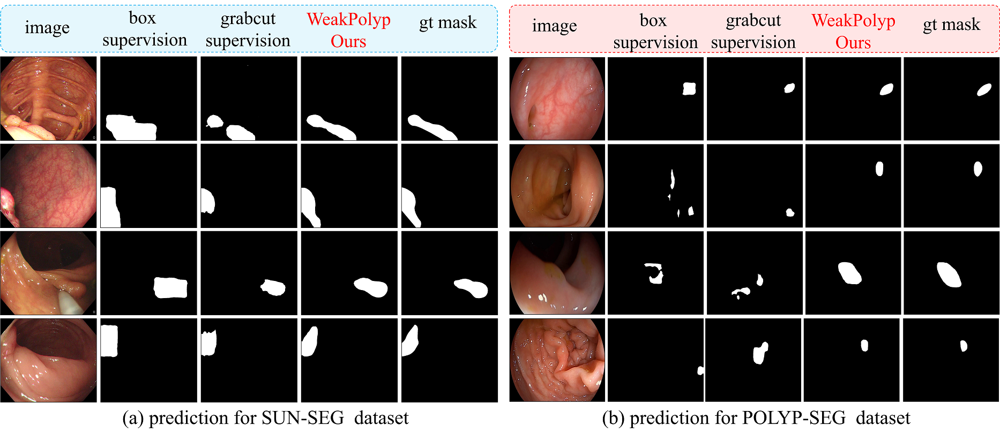

## [WeakPolyp: You Only Look Bounding Box for Polyp Segmentation](https://arxiv.org/pdf/2307.10912.pdf)
by Jun Wei, Yiwen Hu, Shuguang Cui, S.Kevin Zhou, Zhen Li

## Introduction

Limited by expensive pixel-level labels, polyp segmentation models are plagued by data shortage and suffer from impaired generalization. In contrast, polyp bounding box annotations are much cheaper and more accessible. Thus, to reduce labeling cost, we propose to learn a weakly supervised polyp segmentation model (i.e., WeakPolyp) completely based on bounding box annotations. However, coarse bounding boxes contain too much noise. To avoid interference, we introduce the mask-to-box (M2B) transformation. By supervising the outer box mask of the prediction instead of the prediction itself, M2B greatly mitigates the mismatch between the coarse label and the precise prediction. But, M2B only provides sparse supervision, leading to non-unique predictions. Therefore, we further propose a scale consistency (SC) loss for dense supervision. By explicitly aligning predictions across the same image at different scales, the SC loss largely reduces the variation of predictions. Note that our WeakPolyp is a plug-and-play model, which can be easily ported to other appealing backbones. Besides, the proposed modules are only used during training, bringing no computation cost to inference. Extensive experiments demonstrate the effectiveness of our proposed WeakPolyp, which surprisingly achieves a comparable performance with a fully supervised model, requiring no mask annotations at all.

## Clone repository
```shell
git clone https://github.com/weijun88/WeakPolyp
cd WeakPolyp/
```

## Download dataset
The training and testing datasets come from [VPS](https://github.com/GewelsJI/VPS). Download these datasets and unzip them into the folder `WeakPolyp/dataset`.

## Download pretrained model
Two different backbone networks are adopted, please download these models into the `pretrain` folder
- [pvt_v2_b2](https://drive.google.com/drive/folders/1Eu8v9vMRvt-dyCH0XSV2i77lAd62nPXV?usp=sharing)
- [res2net50](https://drive.google.com/file/d/1_1N-cx1UpRQo7Ybsjno1PAg4KE1T9e5J/view?usp=sharing) 


## File tree
```
WeakPolyp
├── dataset
│   └── SUN-SEG
│       ├── TestEasyDataset
│       │   ├── Seen
│       │   │   ├── Frame
│       │   │   └── GT
│       │   └── Unseen
│       │       ├── Frame
│       │       └── GT
│       ├── TestHardDataset
│       │   ├── Seen
│       │   │   ├── Frame
│       │   │   └── GT
│       │   └── Unseen
│       │       ├── Frame
│       │       └── GT
│       └── TrainDataset
│           ├── Frame
│           └── GT
├── figure
│   ├── framework.png
│   ├── performance.png
│   └── visualization.png
├── pretrain
│   ├── pvt_v2_b2.pth
│   └── res2net50_v1b_26w_4s-3cf99910.pth
├── readme.md
└── source
    ├── model.py
    ├── pvtv2.py
    ├── res2net.py
    ├── test.py
    ├── train.py
    └── utils.py
```


## Training
- Resize all images into 352x352 
- Generate box labels from the masks
- Train the model
```shell
    cd source
    python3 train.py
```

## Testing
- Test the performance of WeakPolyp
```shell
    python3 test.py
```

## Predictions
- `dataset/SUN-SEG.zip` contains the masks of `TestEasyDataset` and `TestHardDataset`, predicted by WeakPolyp. We provide these results for evaluation.

## Performance & Visualization
- Quantitative comparisons



- Qualitative comparisons




## Citation
- If you find this work is helpful, please cite our paper
```
@inproceedings{wei2023weakpolyp,
  title={WeakPolyp: You only Look Bounding Box for Polyp Segmentation},
  author={Wei, Jun and Hu, Yiwen and Cui, Shuguang and Zhou, S Kevin and Li, Zhen},
  booktitle={International Conference on Medical Image Computing and Computer-Assisted Intervention},
  pages={757--766},
  year={2023},
  organization={Springer}
}
```
